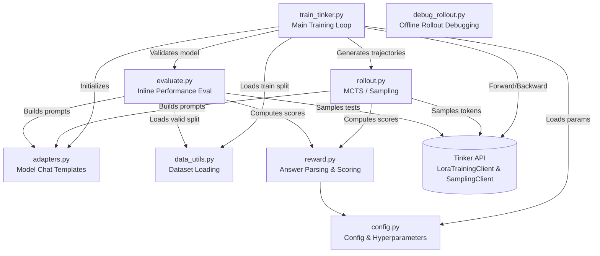

# Tinker RL Training for TDC

[中文版 / Chinese Version](Readme_zh.md)

This directory contains the modularized Python codebase for running **Grounded Reward Policy Optimization (GRPO)** Reinforcement Learning on TDC (Therapeutics Data Commons) tasks using the **Tinker** framework.

## Architecture & Dependency Graph

The training process is orchestrated by `train_tinker.py`, which delegates specific functionalities (configuration, tokenization/formatting, sampling, and evaluation) to specialized modules.

## Module Details and Interaction Logic

### 1. `train_tinker.py` (Main Entry Point)
**Role:** The main training script that coordinates the entire RL loop.
**Workflow:**
- Initializes wandb logging and Tinker clients (`LoraTrainingClient` for gradients, `SamplingClient` for rollouts).
- Initializes the appropriate `ModelAdapter` based on the selected tokenizer.
- Iterates over the training dataloader in batches.
- For each step, it saves temporary sampling weights and triggers `run_batch_rollouts`.
- Computes advantages and translates rollouts into Tinker `Datum` objects. 
- Dispatches `forward_backward` and `optim_step` to the Tinker backend.
- Triggers periodic evaluation via `inline_eval`.

### 2. `config.py`
**Role:** Centralized configuration.
**Contents:**
- `TrainConfig` & `EvalConfig`: Dataclasses defining batch sizes, learning rates, lora ranks, logging details, etc.
- `TASK_GROUPS`: Mapping of specific TDC tasks to higher-level groups (e.g., ADME, Tox, HTS).

### 3. `adapters.py`
**Role:** Ensures compatibility between different model architectures (like Qwen and OpenAI's GPT-OSS).
**Contents:**
- `ModelAdapter` (Base Class): Defines interfaces for parsing model outputs.
- `QwenAdapter` & `GptOssAdapter`: Handle extracting "thinking" / Chain-of-Thought paths, parsing tool calls safely, and identifying final answers.
- `patch_chat_template`: Monkey-patches tokenizer chat templates to fix known rendering bugs.

### 4. `rollout.py`
**Role:** Trajectory collection for RL. 
**Contents:**
- `run_batch_rollouts`: Asynchronously spawns multiple rollouts for the current batch.
- `_single_rollout`: Manages a multi-turn conversation loop. Submits token inputs to the `SamplingClient`, receives generated tokens, tracks sequence log-probabilities, and parses the text into actionable tool calls if necessary.
- **Dependency:** Calls `compute_reward` to score the final textual output.

### 5. `reward.py`
**Role:** The evaluation environment / Reward model. 
**Contents:**
- `extract_answer` & `parse_answer`: Uses Regex rules to strictly locate the model's final multiple-choice answer.
- `compute_reward`: Awards a base reward of 1.0 for correctness, plus a format bonus (defined in config) if the answer respects the requested string layout.

### 6. `evaluate.py`
**Role:** Zero-shot evaluation pipeline to monitor performance during RL.
**Contents:**
- `inline_eval` & `run_eval`: Pauses the training loop, loads the validation split via `data_utils.py`, and spins up purely deductive inference tasks. Computes standardized `macro-F1` scores across all groups and pushes the checkpoint metrics to W&B.

### 7. `data_utils.py`
**Role:** IO operations for `.jsonl` dataset files.
**Contents:**
- `load_train_data` & `load_test_data`: Handles iterating through local datasets and excluding tasks blocked by `cfg.exclude_tasks`.

### 8. `debug_rollout.py`
**Role:** Utility script to inspect and format generated trajectory logs (`.jsonl`).
**Contents:**
- Reads the batch rollout files saved by `train_tinker.py`.
- Formats messages, thinking processes, and rewards into readable console outputs.
- **Usage:**
  - View first rollout: `python debug_rollout.py rollouts/batch_000000.jsonl`
  - View specific line/row (1-indexed): `python debug_rollout.py rollouts/batch_000000.jsonl -r 5`
  - View specific rollout_idx: `python debug_rollout.py rollouts/batch_000000.jsonl -i 2`
  - View N rollouts: `python debug_rollout.py rollouts/batch_000000.jsonl -l 3`
