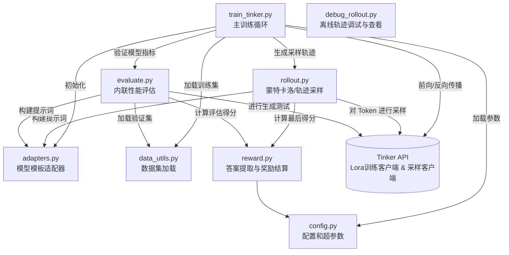

# TDC 任务的 Tinker 强化学习训练

[English Version](Readme.md)

本目录包含了使用 **Tinker** 框架在 TDC (Therapeutics Data Commons) 任务上运行 **GRPO (Grounded Reward Policy Optimization)** 强化学习的重构后模块化 Python 代码库。

## 架构与依赖图

训练过程由 `train_tinker.py` 统筹安排，具体的组件诸如系统配置、模型适配与格式化、采样以及评估都被下放给了独立的专门模块。

## 模块说明与交互逻辑

### 1. `train_tinker.py` (主程序入口)
**职责:** 协调整个强化学习迭代过程的训练主脚本。
**工作流:**
- 初始化 wandb 日志系统和 Tinker 客户端（用于梯度计算的 `LoraTrainingClient` 以及用于采样的 `SamplingClient`）。
- 根据所选模型（Tokenizer），初始化特定的 `ModelAdapter` 适配器。
- 按批次 (Batch) 遍历训练数据。
- 在每个 Step，它会保存临时采样权重，并触发 `run_batch_rollouts` 获取样本生成轨迹。
- 根据各样本的不同回答轨迹计算优势因子 (Advantage)，并将结果封装为 Tinker 需要的 `Datum` 格式。
- 将这些数据推给 Tinker 后端执行 `forward_backward` 和 `optim_step` 进行实际的模型参数更新。
- 定期通过 `inline_eval` 进行性能打分评估。

### 2. `config.py`
**职责:** 集中化参数配置。
**内容:**
- `TrainConfig` & `EvalConfig`: Data class, 定义了模型名称、Batch size、学习率、Lora Rank、最大序列长度及日志路径等。
- `TASK_GROUPS`: 将具体的 TDC 子任务分类到高级宏观任务组中（例如 ADME, Tox, HTS）。

### 3. `adapters.py`
**职责:** 抹平不同模型架构之间的输出与模板差异 (例如 Qwen 与 OpenAI GPT-OSS)。
**内容:**
- `ModelAdapter` (基类): 定义了处理模型解析逻辑的通用接口。
- `QwenAdapter` & `GptOssAdapter`: 具体实现如何提取内部思考 ("thinking" / Chain-of-Thought) 过程、如何安全地提取工具调用 (Tool calls) 等。
- `patch_chat_template`: 动态修改（猴子补丁）Tokenizer 中遗留或错误的聊天模板以支持正确的特殊占位符渲染。

### 4. `rollout.py`
**职责:** 从模型侧收集用于 RL 的生成轨迹样本 (Trajectories)。
**内容:**
- `run_batch_rollouts`: 并行、异步地生成当前 Batch 包含的所有 Prompt 的多种不同回答策略轨迹。
- `_single_rollout`: 管理单次多轮对话回合。它向 `SamplingClient` 提交 Token 并取回生成的回复序列、精准追踪 Token 的 `logprobs`，再将字符串解析检查模型是否需要调用工具等。
- **依赖性:** 调用 `compute_reward` 以在模型返回最终文本时给出奖赏评分。

### 5. `reward.py`
**职责:** 评估环境系统 / 奖励模型。
**内容:**
- `extract_answer` & `parse_answer`: 基于严格甚至有些刻板的正则表达式匹配去模型最后输出文本中捞取多项选择题的答案（如 `Answer: (A)` ）。
- `compute_reward`: 当预测与真实标签匹配时给予 1.0 的基础奖励。此外，如果输出格式规范，系统会附带发放在配置中设定的 `format_bonus` 奖励。

### 6. `evaluate.py`
**职责:** 用于监控 RL 稳健性的 Zero-shot 模型直接推理评估管道。
**内容:**
- `inline_eval` & `run_eval`: 暂停当前的梯度迭代回合，使用 `data_utils.py` 读取验证集（或测试集）并在纯推理场景下运行模型任务。此部分会计算各大数据组和子任务上的宏观 `macro-F1` 分数，最后写入本地和 W&B 数据面板以监控过拟合或者模型灾难性遗忘。

### 7. `data_utils.py`
**职责:** 数据集加载 (.jsonl) 基本 IO 控制。
**内容:**
- `load_train_data` & `load_test_data`: 遍历数据文件夹，跳过那些在 `cfg.exclude_tasks` 中标记被禁止训练/测试的任务，并将数据解析为字典列表返回给管道。

### 8. `debug_rollout.py`
**职责:** 用于查看和格式化生成的模型对话轨迹日志 (`.jsonl`) 的独立实用工具脚本。
**内容:**
- 读取由 `train_tinker.py` 保存的 batch rollout 文件。
- 使用 `rich` 库将思考过程、内部消息和奖励分数渲染为易于阅读的控制台输出。
- **使用说明:**
  - 默认查看文件第一条记录: `python debug_rollout.py rollouts/batch_000000.jsonl`
  - 查看特定行号 (从1开始): `python debug_rollout.py rollouts/batch_000000.jsonl -r 5`
  - 查看特定 rollout_idx: `python debug_rollout.py rollouts/batch_000000.jsonl -i 2`
  - 查看前 N 条记录: `python debug_rollout.py rollouts/batch_000000.jsonl -l 3`
